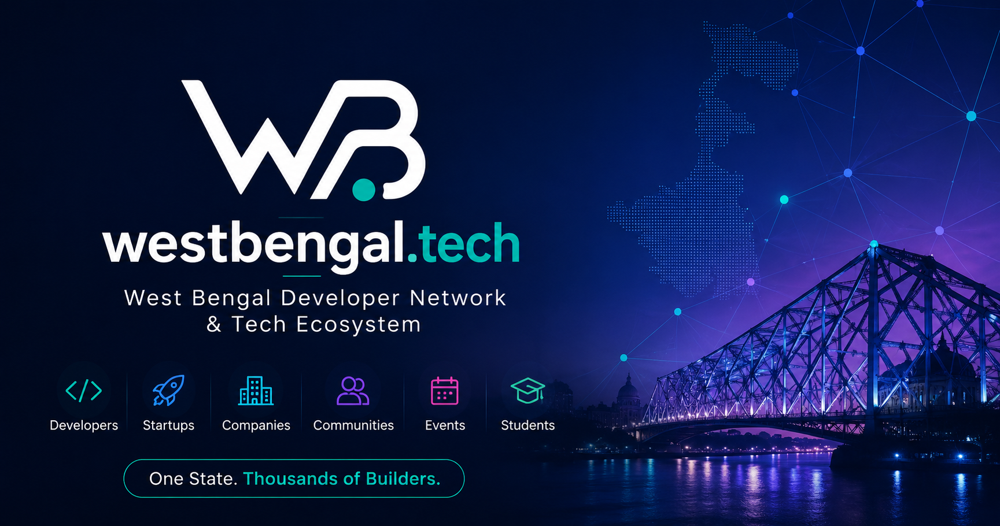

<div align="center">
  

  # 🌐 westbengal.tech

  **The official open-source digital hub connecting software developers, tech startups, open-source projects, and engineering careers across West Bengal.**

  [](https://github.com/wbtechofficial)
  [](LICENSE)
  [](https://nextjs.org)
  [](https://react.dev)

  <p align="center">
    <a href="https://westbengal.tech"><b>Explore Website »</b></a> •
    <a href="https://github.com/wbtechofficial/website/issues">Report Issue</a> •
    <a href="https://github.com/wbtechofficial/website/discussions">Join Discussions</a>
  </p>
</div>

---

## 🌟 Support Us

If you find this project valuable or want to support Bengal's growing tech ecosystem:

<p align="center">
  <b>⭐ Star this repository to show your support and help others discover it! ⭐</b>
</p>

---

## 📖 About the Project

`westbengal.tech` is a community-first, open-source initiative built by developers under the React Kolkata Guild. It serves as a unified digital platform for West Bengal's engineering community — bridging the gap between students, self-taught coders, open-source maintainers, regional startups, and tech companies across Salt Lake Sector V, New Town, Siliguri, and beyond.

### Key Features:
- 🚀 **Ecosystem News & Spotlights**: Discover deep-tech startups, local funding news, and technology roundups.
- 🛠️ **Project Showcase**: Explore, upvote, and feature innovative web applications, Indic AI tools, and open-source libraries.
- 🎤 **Community Events & CFPs**: Access speaker CFPs (such as Open Source Con India) and monthly meetup schedules.
- 💼 **Verified Tech Directory**: Connect with regional software engineering opportunities without recruiter noise.
- ⚡ **Built with Modern Web Stack**: Powered by Next.js 16 (App Router + Turbopack), React 19, TypeScript, and Tailwind CSS.

---

## 🚀 How to Run Locally

Follow these simple steps to set up the project on your local machine:

### Prerequisites
Make sure you have Node.js (v18.17 or higher) installed:
- [Node.js Download](https://nodejs.org)
- npm, yarn, or pnpm package manager

### 1. Clone the Repository
```bash
git clone https://github.com/wbtechofficial/website.git
cd website
```

### 2. Install Dependencies
```bash
npm install
# or
pnpm install
```

### 3. Start the Development Server
```bash
npm run dev
```

Open [http://localhost:3000](http://localhost:3000) in your browser to view the application live.

### 4. Build for Production
```bash
npm run build
npm run start
```

---

## 🤝 How to Contribute

We welcome and appreciate all contributions! Whether you're fixing a typo, improving documentation, adding new features, or submitting your own open-source project — every pull request helps.

### Step-by-Step Contribution Guide:

1. **Fork the Repository**: Click the **Fork** button at the top right of this repository.
2. **Clone your Fork**:
   ```bash
   git clone https://github.com/YOUR-USERNAME/website.git
   cd website
   ```
3. **Create a Feature Branch**:
   ```bash
   git checkout -b feature/your-feature-name
   ```
4. **Make Your Changes**: Keep your code clean, well-formatted, and follow existing styling patterns.
5. **Verify Build & Type Safety**:
   ```bash
   npm run build
   ```
6. **Commit Your Changes**:
   ```bash
   git commit -m "feat: add your awesome feature description"
   ```
7. **Push to Your Branch**:
   ```bash
   git push origin feature/your-feature-name
   ```
8. **Open a Pull Request**: Go to the original repository on GitHub and click **Compare & pull request**. Describe your changes clearly!

---

## 📄 License

Distributed under the MIT License. See `LICENSE` for more information.

<div align="center">
  <sub>Crafted with ❤️ by the West Bengal Tech Guild & Community Builders</sub>
</div>
